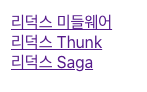
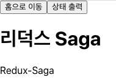

# redux-middleware -> Saga를 이용한 통신, 최적화 Project

> 리덕스 미들웨어 Saga를 사용하여   
> 버튼이 눌렀을때 서버와의 통신, 최적화 작업 진행

- 기술스택 
redux-Saga   react-router   axios

> json-server 실행  
$ npx json-server ./data.json --port 4000

- 리스트 
 
- 선택되었을때  

